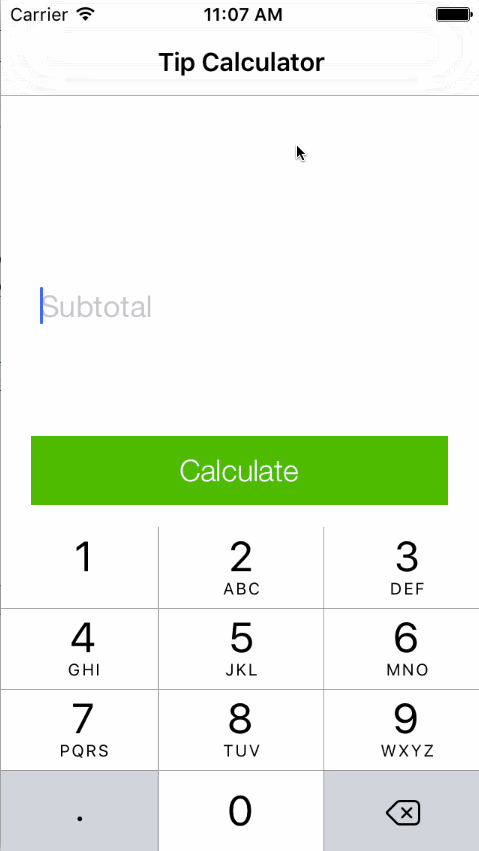

# Pre-work - *TipCal*

**TipCal** is a tip calculator application for iOS.

Submitted by: **Devon Latzen**

Time spent: **6** hours spent in total

## User Stories

The following **required** functionality is complete:
* [x] User can enter a bill amount, choose a tip percentage, and see the tip and total values.

The following **optional** features are implemented:
* [x] Custom font
* [x] UI animations
* [x] Making sure the keyboard is always visible and the bill amount is always the first responder. This way the user doesn't have to tap anywhere to use this app. Just launch the app and start typing.

The following **additional** features are implemented:

- [x] Pretty awesome green color.

## Video Walkthrough 

Here's a walkthrough of implemented user stories:

GIF created with [LiceCap](http://www.cockos.com/licecap/).

## Notes
Challenges:

I ran into a recurring error "Thread 1: signal SIGABRT" which pretty much drove me crazy until I found a Youtube video addressing it. So that was good. 

I kept wishing I knew more of the syntax, like missing words in a vocabulary. I wanted the command for "Make this text field automaticaly have focus." But I didn't know how to write that in code. I also wanted to change the color of elements, but that wasn't as straightforward as editing a hex value. Took a lot of time to figure out the syntax for things I take for granted in other contexts.

It was also hard to figure out what the Readme was asking for in the "Video Walkthrough" section. The tutorial showed us how to embed a gif, but the "href" in the Readme template seemed to be asking for an image held in a mythical "course_images" directory. That threw me because I didn't find any instructions for how to upload my gif to that directory. I eventually decided to embed it and hope for the best.

I'm planning to add more elegant animations, with a larger "subtotal" initial screen, along with a "split" option.

Thanks!

## License  

    Copyright 2016 Devon Latzen

    Licensed under the Apache License, Version 2.0 (the "License");
    you may not use this file except in compliance with the License.
    You may obtain a copy of the License at

        http://www.apache.org/licenses/LICENSE-2.0

    Unless required by applicable law or agreed to in writing, software
    distributed under the License is distributed on an "AS IS" BASIS,
    WITHOUT WARRANTIES OR CONDITIONS OF ANY KIND, either express or implied.
    See the License for the specific language governing permissions and
    limitations under the License.
